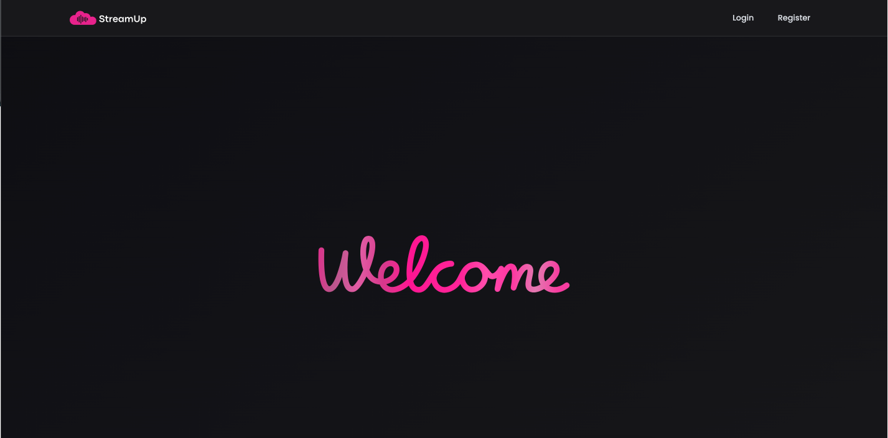
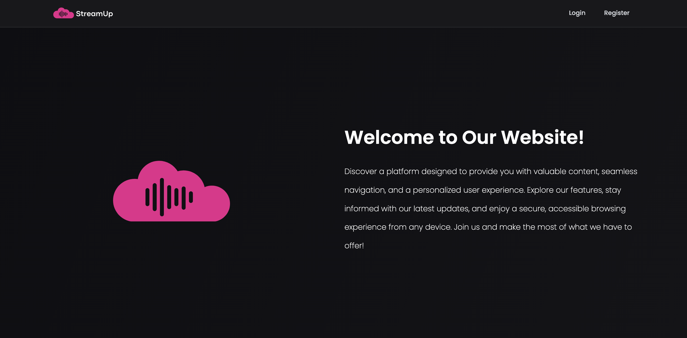
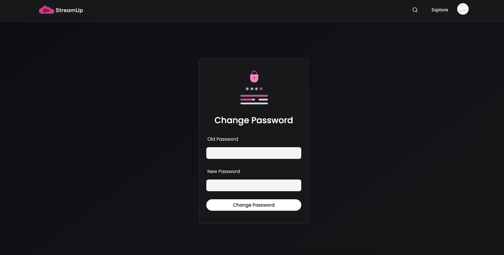
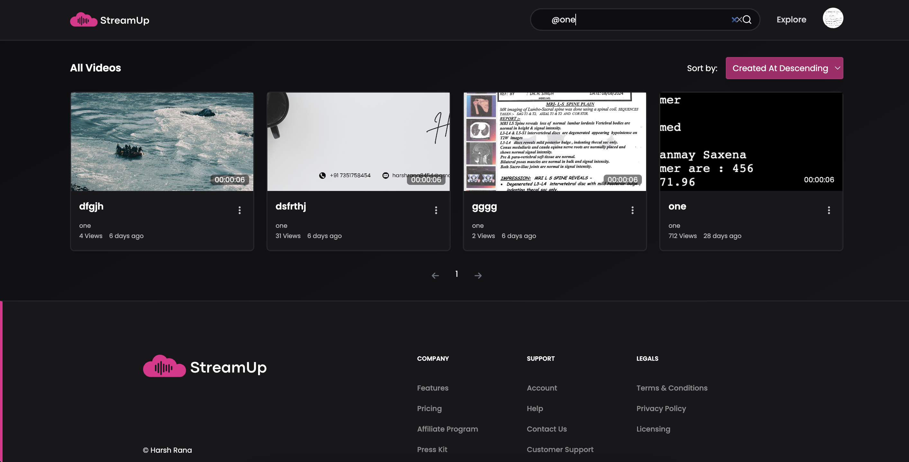
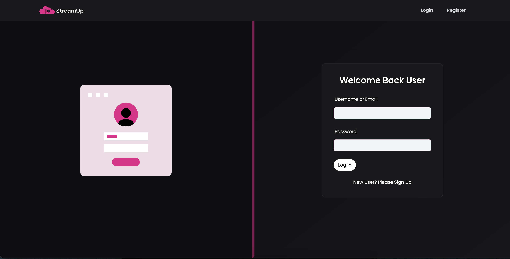
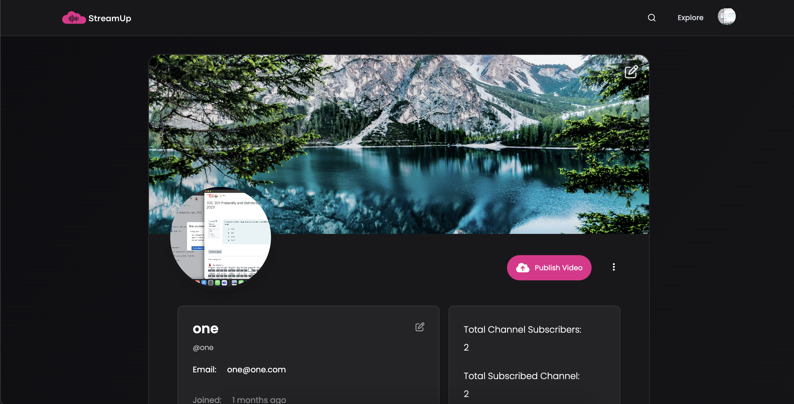
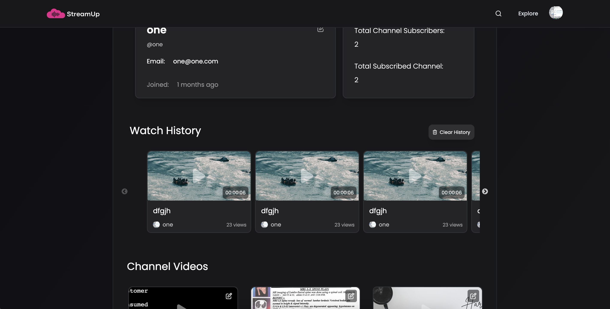

# StreamUp
StreamUp is a YouTube-inspired platform for streaming and sharing videos. It allows users to watch, like, and comment on videos, manage personal profiles, create custom playlists, and post their own videos. With its user-friendly interface and feature-rich experience, StreamUp delivers a comprehensive video-sharing experience.


##  Table of Contents
- Features
- Technologies Used
- Environment Variables
- Installation
- Screenshots
- Acknowledgements

## Features
- Watch Videos: Stream and enjoy content uploaded by other users.
- Like and Comment: Engage with videos through likes and comments.
- Custom Playlists: Create and manage personalized playlists.
- Profile Management: Edit and manage personal profile details.
- Video Posting: Seamlessly upload and share videos with the community.
- Dashboard: View video statistics and manage uploaded content.

## Technologies Used
- MongoDB: Stores user data, video metadata, and custom playlists. Advanced MongoDB aggregation pipelines are used to handle complex queries and data retrieval.
- Express.js: Backend framework for building RESTful API endpoints and managing server-side logic.
- React: Frontend library for building interactive UI components and managing user interactions.
- Node.js: Server-side runtime environment for running JavaScript code, handling requests, and connecting the frontend to the backend.
- Cloudinary: Used for efficient video storage, media optimization, and seamless integration with the application.
- Redux: Global state management, particularly for handling logged-in user profiles and ensuring seamless transitions between app features.
- JWT (JSON Web Tokens): Secure authentication and authorization mechanism for handling user login and feature access.
- Other: HTML, CSS, JavaScript

## Environment Variables

To run this project, you will need to add the following environment variables to your .env file

`PORT`

`MONGO_URL`

`ACCESS_TOKEN_SECRET`

`ACCESS_TOKEN_EXPIRY`

`REFRESH_TOKEN_SECRET`

`REFRESH_TOKEN_EXPIRY`

`CORS_ORIGIN`

`CLOUDINARY_CLOUD_NAME`

`CLOUDINARY_API_KEY`

`CLOUDINARY_API_SECRET`


## Installation

1. Clone the repository:

```bash
  git clone https://github.com/kashifkamran000/StreamUp.git
  cd StreamUp
```
2. Install dependencies:
```bash
  npm install
```

3. Run the application:

Backend:
```bash
  npm run start
```
Frontend:
```bash
  npm run dev
```


## Screensorts

Home Page:








Change Password Page:





Explore Page:





Login Page: 





Dashboard Page: 








## Acknowledgements

- MERN Stack community for their resources and support.
- Cloudinary for media management and optimization tools.
- Redux Toolkit for simplifying state management.


